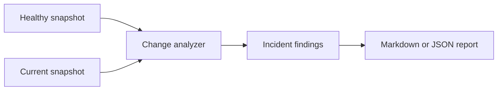

# Network Flight Recorder

An explainable, local-first network diagnostic tool that records a known-good Linux network
state, detects what changed during an outage, and produces an evidence-based incident report.

> **Project status:** working MVP. Snapshot collection targets Linux. AWS infrastructure,
> dashboarding, failure injection, and guarded remediation are planned and clearly separated
> from implemented features.

## Why this exists

Traditional monitoring tells an operator that something is down. Network Flight Recorder is
designed to answer the next question: **What changed immediately before the failure?**

The MVP records routes, interfaces, DNS resolvers, failed services, and optional reachability
probes. It compares a healthy baseline with a later snapshot, correlates related symptoms into
one likely root cause, and explains each change with evidence and a verification step.

## Two-minute demonstration

```bash
# Install in an isolated environment
python3 -m venv .venv
source .venv/bin/activate
python -m pip install -e ".[dev]"

# Capture a known-good baseline
nfr snapshot --probe 1.1.1.1 --dns example.com --output snapshots/baseline.json

# Make an authorized change in a disposable lab, then capture current state
nfr snapshot --probe 1.1.1.1 --dns example.com --output snapshots/current.json

# Reconstruct the incident
nfr compare snapshots/baseline.json snapshots/current.json \
  --output reports/incident.md
```

To pseudonymize hostnames, IP addresses, and probe targets while keeping comparisons stable:

```bash
export NFR_REDACTION_KEY="use-a-long-private-value"
nfr snapshot --redact --probe 1.1.1.1 --dns example.com --output snapshots/shared.json
```

Retention cleanup is a dry run unless `--apply` is supplied:

```bash
nfr prune --directory snapshots --keep 100 --max-age-days 30
nfr prune --directory snapshots --keep 100 --max-age-days 30 --apply
```

No Linux lab available yet? Run the included fixture demonstration:

```bash
nfr compare tests/fixtures/healthy.json tests/fixtures/broken.json
```

Example findings include:

- Default route disappeared
- DNS configuration became empty or changed
- A DNS lookup failed or became unusually slow
- A previously healthy interface went down
- A reachability probe began failing
- A new systemd service failure appeared

When several symptoms share a cause, the report leads with an explainable diagnosis such as
`Local interface or link failure — HIGH confidence` and lists the supporting evidence.

## Skills demonstrated

- TCP/IP troubleshooting, routing, DNS, interfaces, gateways, and reachability
- Linux administration, systemd, logs, permissions, and safe subprocess handling
- Python packaging, structured JSON, command-line design, and automated testing
- Incident-response documentation and evidence-based diagnosis
- Secure-by-default design and human-approved remediation planning
- GitHub Actions continuous integration

## Architecture



See [the architecture document](docs/architecture.md) and [project roadmap](ROADMAP.md).

## Scope and safety

The current collector uses read-only local commands. It does not scan other systems, capture
packets, collect credentials, or make network changes. Use it only on systems and networks you
own or are authorized to administer. Review [SECURITY.md](SECURITY.md) before sharing snapshots.

## Planned innovation

The project will evolve into a cloud-assisted network black box with a reproducible outage lab,
correlated root-cause analysis, encrypted AWS evidence storage, Terraform-managed infrastructure,
and approval-gated recovery with automatic verification and rollback.

## Author

Ashley “Patience” Hopkins  
WGU B.S. Cloud and Network Engineering — AWS Track  
CompTIA A+ · CompTIA Network+ · LPI Linux Essentials · ITIL 4 Foundation
