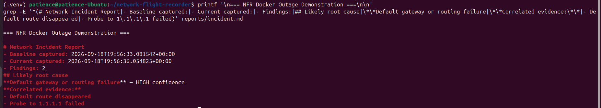
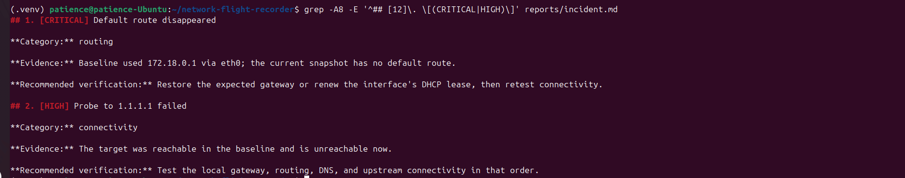
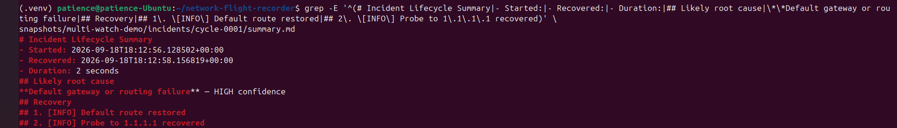
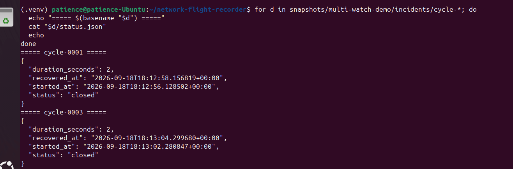
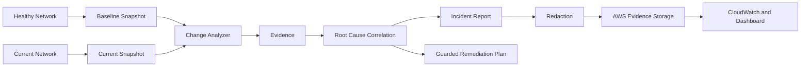

# Network Flight Recorder

> **A black box for your network.**

Network outages are easy to notice and harder to reconstruct. By the time troubleshooting starts, the route, resolver state, interface condition, or latency change that mattered may already be gone.

Network Flight Recorder (NFR) is a local-first Linux troubleshooting and observability tool built to preserve that evidence. It records a known-good state, detects meaningful changes, correlates related symptoms, tracks incidents through recovery, and produces evidence-backed reports.

**Healthy state → change → failure → evidence → diagnosis → recovery**

[](https://github.com/PatienceEnoch/network-flight-recorder/actions/workflows/test.yml)

Core diagnosis stays local. AWS adds durable storage and operational visibility, but NFR does not depend on cloud connectivity to investigate an outage that may have broken that connectivity in the first place.

**New to NFR?** Read the [User Guide](docs/user-guide.md) for installation, first-run steps, command examples, monitoring, Docker demonstrations, AWS integration, and troubleshooting.

---

## What it records

A snapshot can include:

- Routes and default gateway
- Network interfaces
- IP addresses
- DNS resolvers
- Failed systemd services
- Reachability probes
- DNS lookup results
- Latency
- Packet loss
- MTU information

The system can then compare a known-good baseline against the current state.

---

## From symptoms to diagnosis

A basic monitoring tool might report:

```text
Default route missing
External probe failed
DNS lookup failed
```

Network Flight Recorder attempts to connect those symptoms.

For example:

```text
Default route disappeared
        |
External reachability failed
        |
Multiple network probes failed
        |
Likely diagnosis:

Default gateway or routing failure
Confidence: HIGH
```

The diagnosis is accompanied by the evidence that produced it.

This makes the result easier to investigate and verify instead of simply producing more alerts.

---

## Quick start

Create an isolated Python environment:

```bash
python3 -m venv .venv
source .venv/bin/activate
python -m pip install -e ".[dev]"
```

Capture a known-good baseline:

```bash
nfr snapshot \
  --probe 1.1.1.1 \
  --dns example.com \
  --output snapshots/baseline.json
```

After an authorized network change or outage, capture the current state:

```bash
nfr snapshot \
  --probe 1.1.1.1 \
  --dns example.com \
  --output snapshots/current.json
```

Compare the two states:

```bash
nfr compare \
  snapshots/baseline.json \
  snapshots/current.json \
  --output reports/incident.md
```

No Linux lab available?

Run the included fixture demonstration:

```bash
nfr compare tests/fixtures/healthy.json tests/fixtures/broken.json
```

---

## Reproducible outage lab

The project includes a Docker-based failure-injection lab that creates a real networking failure inside an isolated container.

Run:

```bash
./lab/run_demo.sh
```

The demonstration:

1. Creates a disposable Docker environment.
2. Records the healthy network state.
3. Removes the container's default route.
4. Captures the resulting outage.
5. Compares the healthy and broken states.
6. Diagnoses the routing failure.
7. Generates an incident report.
8. Restores the Docker-managed network.

The failure occurs only inside the disposable container.





This initial diagnostic demonstration is preserved as a
[historical validation record](docs/validated-demo.md). The
[current validation record](docs/validation-status.md) covers the expanded
test suite, guarded recovery, and CI checks.

For the approval-gated recovery demonstration, run:

```bash
./lab/run_guarded_recovery.sh
```

That workflow restores the known-good default route inside the container,
verifies the result, and writes `reports/remediation.md` with before-and-after
evidence.

---

## What it can detect

Network Flight Recorder can identify changes such as:

- Default route disappearance
- Gateway or routing changes
- DNS configuration changes
- DNS lookup failures
- Resolver response changes
- Interface state changes
- Address changes
- MTU changes
- Increased latency
- Packet loss
- Reachability failures
- Newly failed systemd services

When multiple symptoms point to the same underlying problem, the report can lead with a correlated diagnosis such as:

```text
Default gateway or routing failure — HIGH confidence
```

or:

```text
Local interface or link failure — HIGH confidence
```

Supporting evidence is included with the diagnosis.

---

## Privacy and evidence protection

Network diagnostic data can expose sensitive infrastructure information.

Network Flight Recorder supports deterministic pseudonymization of:

- Hostnames
- IP addresses
- Probe targets

Set a private redaction key:

```bash
export NFR_REDACTION_KEY="use-a-long-private-value"
```

Then capture a protected snapshot:

```bash
nfr snapshot \
  --redact \
  --probe 1.1.1.1 \
  --dns example.com \
  --output snapshots/shared.json
```

The same values remain comparable across snapshots without exposing the original network information.

Retention cleanup also defaults to a dry run:

```bash
nfr prune --directory snapshots --keep 100 --max-age-days 30
```

Changes are only applied when explicitly requested:

```bash
nfr prune \
  --directory snapshots \
  --keep 100 \
  --max-age-days 30 \
  --apply
```

---

## AWS operations layer

Network Flight Recorder also includes a Terraform-managed AWS operations layer.

Current capabilities include:

- Private S3 evidence storage
- S3 versioning
- SSE-S3 encryption
- Encryption in transit
- Public-access blocking
- Redacted evidence upload
- CloudWatch health metrics
- Incident summary storage
- Minimal operational dashboarding

Infrastructure is defined under:

```text
infra/aws/
```

This keeps the AWS environment reproducible and managed as code.

---

## Monitoring and incident workflow

Watch mode turns one-time snapshot comparison into an incident timeline. It can detect failure and recovery transitions, maintain incident state, preserve evidence, recover an open incident after restart, and write a final lifecycle summary.

Start a bounded watch session with preserved snapshot history:

```bash
nfr watch \
  --interval 30 \
  --cycles 10 \
  --probe 1.1.1.1 \
  --dns example.com \
  --snapshot-dir snapshots/watch \
  --snapshot-limit 100
```

Watch mode detects failure and recovery transitions, maintains incident state,
protects incident evidence from rolling snapshot cleanup, and writes a final
lifecycle summary after recovery.

### Live incident lifecycle

The watch demonstration captures an outage, identifies the likely routing failure,
detects recovery, closes the incident, and records the total outage duration.



### Multiple sequential incidents

A continuous watch session was also validated across two separate outages. Each
incident was independently opened, recovered, and closed.



See the [CLI reference](docs/cli-reference.md) for all commands.

---

## Guarded recovery

Network Flight Recorder is intentionally conservative about remediation.

Detection and diagnosis can be automated.

Making changes to a network requires stronger safeguards.

The recovery layer therefore uses:

- Explicitly allowed remediation actions
- Approval-required remediation plans
- Human review before changes
- Guardrails around supported actions
- Automatic post-change verification
- Before-and-after remediation reports

Execution is currently limited to the isolated Docker lab and one tightly
scoped route-restoration action. The lab also demonstrates automatic rollback
when post-remediation verification fails. Generic or production remediation
is not implemented.

---

## Architecture



See the [architecture document](docs/architecture.md) for more detail.

---

## Continuous integration

Every push and pull request is checked automatically with GitHub Actions.

The CI pipeline currently includes:

```text
Python
├── Ruff linting
└── pytest

Security
└── Python dependency audit

Infrastructure
├── terraform fmt
├── terraform init
└── terraform validate
```

This continuously checks the application, dependencies, and infrastructure configuration.

---

## Project roadmap

### Phase 1 — Local Flight Recorder

Completed:

- Capture Linux network state
- Compare healthy and current snapshots
- Generate Markdown and JSON incident reports
- Test common outage signatures

### Phase 2 — Explainable Diagnosis

Completed:

- Detect address, MTU, latency, and packet-loss changes
- Detect DNS resolver behavior changes
- Correlate related symptoms
- Add snapshot redaction
- Add retention controls
- Build a reproducible Docker outage lab

### Phase 3 — AWS Operations Layer

Completed:

- Terraform-managed AWS infrastructure
- Private and encrypted S3 evidence storage
- Redacted evidence upload
- CloudWatch health metrics
- Incident summaries
- Minimal operational dashboard
- CI security and infrastructure checks

### Phase 4 — Guarded Recovery

Completed:

- Approval-required remediation plans
- Explicit action allowlist
- Safety guardrails
- Approved recovery execution in the isolated Docker lab
- Automatic recovery verification
- Before-and-after remediation reporting
- Rollback after failed recovery verification in the isolated Docker lab

### Phase 5 — Continuous Monitoring

Completed:

- Bounded or continuous `nfr watch` monitoring
- Failure and recovery transition detection
- Rolling snapshot retention
- Protected incident evidence

### Phase 6 — Incident Lifecycle

Completed:

- Open and closed incident tracking
- Restart recovery for persisted open incidents
- Outage duration calculation
- Final failure-to-recovery summaries

Multiple sequential incidents have also been validated in one continuous
watch session, with each outage independently opened, recovered, closed, and
summarized.

See [ROADMAP.md](ROADMAP.md) for the full roadmap.

---

## Technologies

### Networking

- TCP/IP
- Routing
- DNS
- Network interfaces
- Default gateways
- Reachability testing
- Latency
- Packet loss

### Development

- Python
- pytest
- Ruff
- Command-line application design
- JSON
- Git

### Linux

- Ubuntu
- systemd
- Network troubleshooting
- Permissions
- Safe subprocess execution

### Cloud and Infrastructure

- AWS
- Amazon S3
- Amazon CloudWatch
- IAM
- Terraform

### DevOps and Security

- GitHub Actions
- Docker
- Dependency auditing
- Encryption
- Evidence redaction
- Infrastructure validation

---

## Design constraints

A few rules keep NFR from becoming an unsafe "self-healing network" demo:

1. **Diagnosis must survive the outage.** Core analysis stays local.
2. **Evidence comes before action.** Findings and remediation decisions are tied to observable state.
3. **A diagnosis must be inspectable.** Correlation should show why it reached a conclusion.
4. **Sensitive evidence is protected before central storage.**
5. **Remediation stays narrow, approved, and verifiable.**
6. **Failure testing stays isolated.** The Docker lab changes container networking, not the host.

The project is meant to make troubleshooting clearer without giving automation unrestricted authority over the network.

---

## Author

**Ashley “Patience” Hopkins**

WGU B.S. Cloud and Network Engineering — AWS Track

CompTIA A+ · CompTIA Network+ · LPI Linux Essentials · ITIL 4 Foundation
