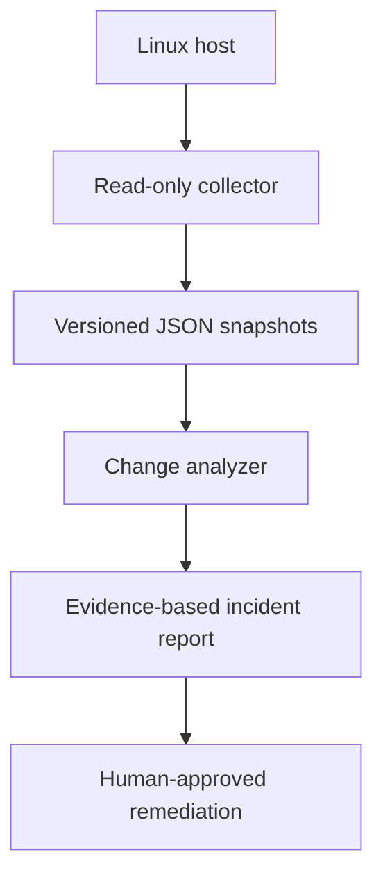

# Architecture

Network Flight Recorder begins as a local-first diagnostic tool. It captures read-only state,
stores versioned snapshots, compares a known-good baseline with a degraded state, and produces
an explainable incident report.

## Design principles

1. **Evidence before action:** The MVP recommends verification steps but makes no changes.
2. **Local-first:** Snapshot and comparison work without cloud connectivity.
3. **Explainable findings:** Every diagnosis contains observable evidence and a next step.
4. **Least privilege:** Collection uses ordinary read-only operating-system commands.
5. **Portable evidence:** JSON snapshots and Markdown reports are easy to inspect and archive.

## Planned AWS extension

The next phase will provision an encrypted S3 evidence bucket, DynamoDB incident index,
CloudWatch metrics and alerts, and a small API/dashboard through Terraform. Raw snapshots will
remain private. A redacted summary will be used for demonstrations.

