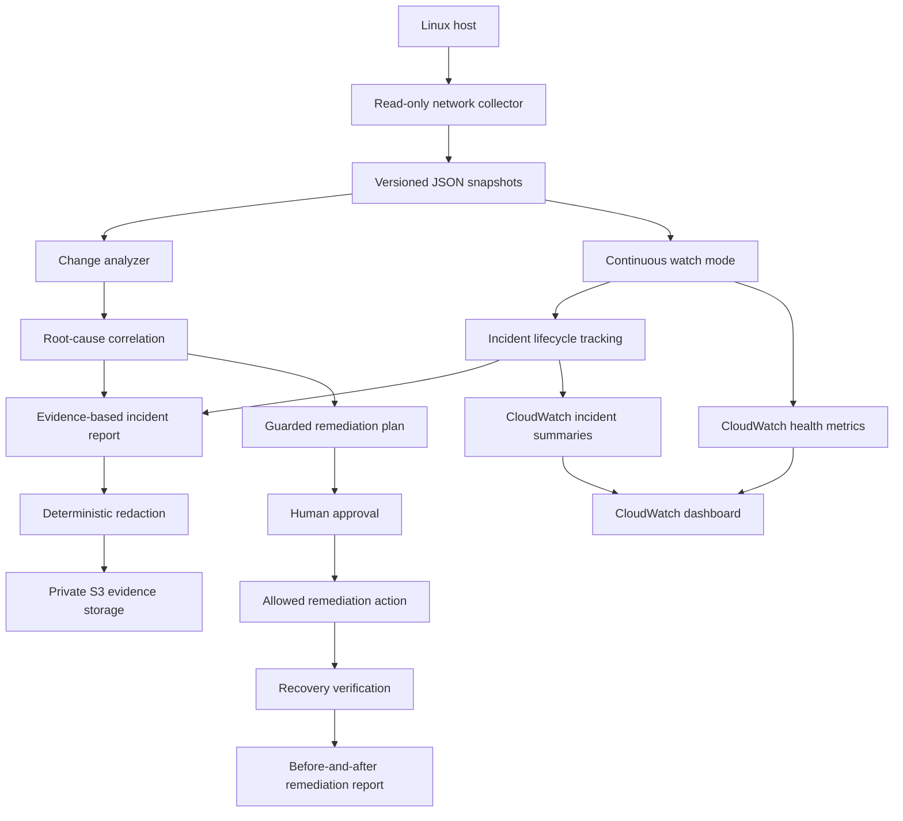

# Architecture

Network Flight Recorder is a local-first network observability and incident-response system.

Its core responsibility is to preserve enough evidence around a network failure to answer:

> What changed, what failed, and what evidence supports the diagnosis?

The architecture intentionally separates local diagnosis from cloud operations so that a loss of external connectivity does not remove the ability to investigate the outage.

---

## High-level architecture



---

## Architectural layers

### 1. Local diagnostic layer

The local layer is the foundation of the system.

It can capture and compare network state without requiring AWS connectivity.

A snapshot can include:

- Routes and default gateway
- Network interfaces
- IP addresses
- DNS resolvers
- Failed systemd services
- Reachability probes
- DNS lookup results
- Latency
- Packet loss
- MTU information

The analyzer compares a known-good state with a later state and produces findings that are tied to observable evidence.

This keeps the core troubleshooting workflow available during the exact condition it is designed to investigate: network failure.

---

### 2. Explainable diagnosis

Network Flight Recorder does not stop at listing unrelated symptoms.

The correlation layer combines related findings into a likely root cause.

For example:

```text
Default route disappeared
        |
External reachability failed
        |
Multiple probes failed
        |
Likely cause:
Default gateway or routing failure
Confidence: HIGH
```

The goal is not to hide the reasoning behind a diagnosis.

Each conclusion should remain traceable to the evidence that produced it.

---

### 3. Continuous monitoring and incident lifecycle

The architecture now supports more than one-time snapshot comparison.

Watch mode can repeatedly capture live network state and detect transitions between healthy and degraded conditions.

The incident lifecycle layer can preserve:

- Failure detection time
- Open incident state
- Protected before-and-after evidence
- Recovery time
- Outage duration
- Final failure-to-recovery summary
- Persisted incident state across restarts

The operational model becomes:

```text
Healthy
  |
Failure transition
  |
Incident opened
  |
Evidence preserved
  |
Recovery transition
  |
Incident closed
  |
Lifecycle summary
```

---

### 4. Privacy and evidence protection

Network diagnostic data can contain sensitive infrastructure information.

Network Flight Recorder supports deterministic pseudonymization of values such as:

- Hostnames
- IP addresses
- Probe targets

Because the same source value maps consistently to the same protected value, evidence can remain comparable across snapshots without exposing the original infrastructure details.

Retention controls also default to dry-run behavior so destructive cleanup requires an explicit action.

---

### 5. AWS operations layer

AWS is an operations and evidence layer rather than a dependency for core diagnosis.

Infrastructure is managed with Terraform under:

```text
infra/aws/
```

Current AWS capabilities include:

- Private Amazon S3 evidence storage
- S3 versioning
- SSE-S3 encryption at rest
- Public-access blocking
- Enforcement of encrypted transport
- Redacted evidence upload
- Amazon CloudWatch custom health metrics
- CloudWatch incident-summary logging
- CloudWatch log retention
- Operational dashboarding

This creates a separation between detailed local evidence and centralized operational visibility.

### Evidence path

```text
Network state
    |
Local diagnosis
    |
Redaction
    |
TLS-protected transfer
    |
Private, versioned S3 evidence
```

### Operational visibility path

```text
Health events -----------------> CloudWatch metrics
Incident lifecycle summaries --> CloudWatch Logs
                                  |
                                  v
                           CloudWatch dashboard
```

---

## Guarded remediation

Detection and diagnosis can be highly automated.

Changing network state requires stronger controls.

The remediation architecture therefore uses:

- Explicitly allowed action IDs
- Approval-required remediation plans
- Safety guardrails
- Human review before execution
- Recovery verification after execution
- Before-and-after remediation reporting

The intended control flow is:

```text
Observe
   |
Diagnose
   |
Propose
   |
Approve
   |
Execute
   |
Verify
```

This is deliberately different from automatically modifying a network immediately after detecting a symptom.

Rollback validation remains a roadmap item for cases where a remediation action does not restore the expected state.

---

## Reproducible failure-injection lab

The project includes a Docker-based lab for controlled outage testing.

The lab can:

1. Start an isolated disposable environment.
2. Capture a healthy network baseline.
3. Remove the container's default route.
4. Capture the degraded state.
5. Compare healthy and failed snapshots.
6. Diagnose the routing failure.
7. Execute an approved recovery action.
8. Verify that connectivity was restored.
9. Generate remediation evidence.

The failure is contained inside the disposable Docker environment.

This allows the architecture to be tested against a real failure state without modifying the host network.

---

## Continuous integration and infrastructure validation

GitHub Actions continuously checks both the application and its infrastructure definition.

### Python

- Ruff linting
- pytest

### Security

- Python dependency auditing

### Terraform

- `terraform fmt -check -recursive`
- `terraform init -backend=false`
- `terraform validate`

This creates automated validation around application behavior, dependency risk, and infrastructure configuration.

---

## Design principles

1. **Local-first operation**  
   Core diagnosis must remain useful when cloud connectivity is unavailable.

2. **Evidence before action**  
   Findings and remediation decisions should be supported by observable state.

3. **Explainability**  
   A diagnosis should show why the system reached that conclusion.

4. **Least privilege**  
   Collection favors read-only operating-system commands and narrow permissions.

5. **Separation of concerns**  
   Local diagnosis, cloud operations, storage, and remediation are distinct responsibilities.

6. **Privacy by design**  
   Diagnostic evidence is protected before centralized storage or sharing.

7. **Infrastructure as code**  
   AWS resources are reproducible and reviewable through Terraform.

8. **Failure-aware testing**  
   The system is tested against deliberate, isolated outages rather than only healthy states.

9. **Human-controlled remediation**  
   Automation can recommend and verify changes without granting unrestricted authority to modify network state.

10. **Lifecycle thinking**  
    An incident is treated as a sequence from healthy state through failure and recovery, not as a single alert.

---

## Failure-domain reasoning

One of the most important architectural decisions in Network Flight Recorder is that the primary diagnostic capability does not depend on the external network path it may be troubleshooting.

If AWS becomes unreachable because the local route, gateway, DNS path, or upstream network has failed, the recorder can still collect local evidence and perform diagnosis.

AWS then becomes a secondary operations layer that provides durable evidence storage and centralized visibility when connectivity is available.

This reduces the number of components that share the same failure domain.

---

## Current architecture status

Implemented:

- Local snapshot collection
- Healthy-to-current comparison
- Evidence-backed diagnosis
- Root-cause correlation
- Deterministic redaction
- Retention controls
- Docker failure injection
- Terraform-managed AWS infrastructure
- Private and encrypted S3 evidence storage
- CloudWatch health metrics
- Incident-summary logging
- CloudWatch dashboarding
- GitHub Actions validation
- Approval-required remediation plans
- Remediation action allowlist
- Recovery execution in the isolated lab
- Automatic recovery verification
- Before-and-after remediation reports
- Continuous watch mode
- Incident lifecycle tracking
- Failure and recovery detection
- Persistent open-incident recovery after restart

Still being validated or expanded:

- Rollback behavior when recovery verification fails
- Complete end-to-end monitored failure-to-recovery demonstration
- Multiple sequential incidents in one long-running watch session
- Final portfolio-release documentation and validation

---

## Summary

Network Flight Recorder began as a local troubleshooting utility, but its architecture now spans network observability, incident response, privacy, cloud operations, infrastructure as code, CI validation, controlled remediation, and incident lifecycle management.

The central architectural rule remains:

> Preserve the ability to observe and explain failure before adding the authority to change the system.
