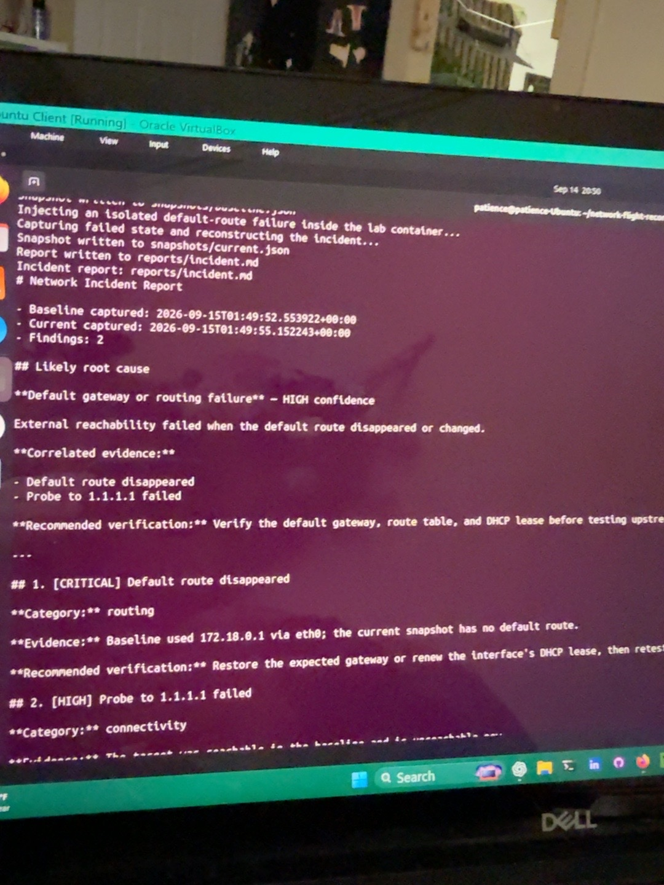
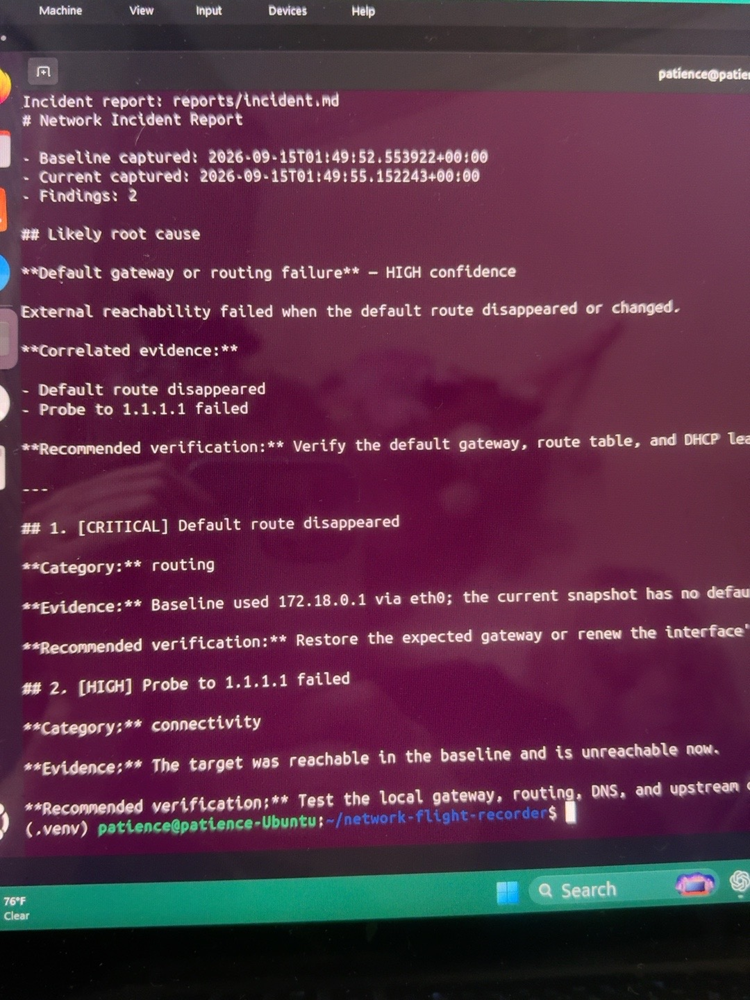

# Validated Docker outage demonstration

## Environment

- Validation date: September 14, 2026 (September 15 UTC)
- Guest operating system: Ubuntu 24.04.4 LTS
- Virtualization: Oracle VirtualBox
- Docker Engine: 29.1.3
- Docker Compose: 2.40.3
- Python: 3.12.3
- Automated test result: 11 passed

## Procedure

The repository's `lab/run_demo.sh` script built and started the isolated recorder container,
captured a healthy baseline, deleted only the container's default route, captured current state,
and compared the snapshots. Its cleanup trap restarted the container after the report was
generated.

## Observed evidence

- Baseline default gateway: `172.18.0.1` via `eth0`
- Current snapshot: no default route
- Baseline probe to `1.1.1.1`: reachable
- Current probe to `1.1.1.1`: unreachable

## Diagnosis

Network Flight Recorder produced two findings:

1. **CRITICAL:** Default route disappeared
2. **HIGH:** Probe to `1.1.1.1` failed

It correlated the findings into **Default gateway or routing failure — HIGH confidence** and
recommended verifying the gateway, route table, and DHCP lease before testing the upstream path.

## Result

The demonstration completed successfully and returned control to the terminal. This validates
the complete Phase 2 path from failure injection through evidence collection, comparison,
correlation, reporting, and cleanup.

